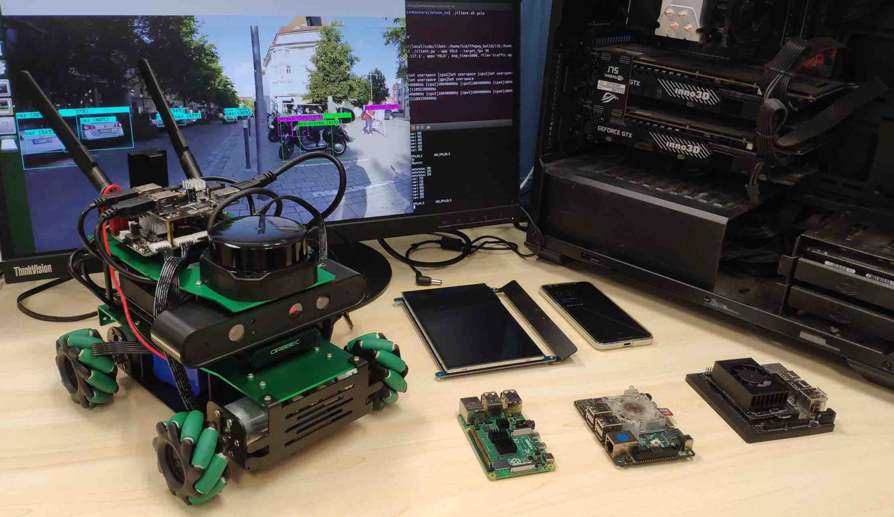

## GearDVFS: A Workload-Aware DVFS Robust to Concurrent Tasks for Mobile Devices


## **Overview**

Power governing is a critical component of modern mobile devices, reducing heat generation and extending device battery life. A popular technology of power governing is dynamic voltage and frequency scaling (DVFS), which adjusts the operating frequency of a processor to balance its performance and energy consumption. With the emergence of diverse workloads on mobile devices, traditional DVFS methods that do not consider workload characteristics become suboptimal. Recent application-oriented methods propose dedicated and effective DVFS governors for individual application tasks. Since their approach is only tailored to the targeted task, performance drops significantly when other tasks run concurrently, which is however common on today’s mobile devices. In this paper, our key insight is that hardware meta-data, widely used in existing DVFS designs, has great potential to enable capable workload awareness and task concurrency adaptability for DVFS, but they are underexplored. We find that workload characteristics can be described in a hyperspace composed of multiple dimensions derived from these metadata to form a novel workload contextual indicator to profile task dynamics and concurrency. On this basis, we propose a meta-state metric to capture this relationship and design a new solution, GearDVFS. We evaluate it for a rich set of mobile application tasks, achieving up to 23.9%~26.9% energy efficiency improvements over state-of-the-art DVFS methods.


## Demo 



## Publication

**A Workload-Aware DVFS Robust to Concurrent Tasks for Mobile Devices**

Chengdong Lin, Kun Wang, Zhenjiang Li, Yu Pu

**ACM MobiCom, 2023**

<a href="https://dl.acm.org/doi/abs/10.1145/3570361.3592524">[pdf]</a>  <a href="https://github.com/geardvfs/GearDVFS">[code]</a>  <a href="">[slides]</a>

## Citation

If you find our work useful in your research, please consider citing:

```
@inproceedings{lin2023workload,
  title={A Workload-Aware DVFS Robust to Concurrent Tasks for Mobile Devices},
  author={Lin, Chengdong and Wang, Kun and Li, Zhenjiang and Pu, Yu},
  booktitle={Proceedings of the 29th Annual International Conference on Mobile Computing and Networking},
  pages={1--16},
  year={2023}
}
```


